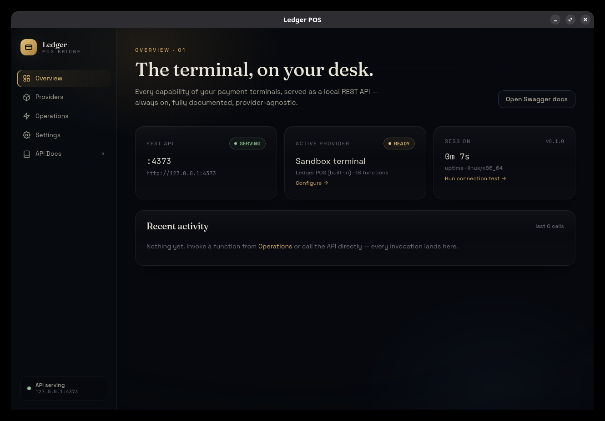

# Ledger POS

A personal, cross-platform desktop bridge that exposes **payment POS terminals as an
always-available local REST API** — with a premium desktop console built on
**Tauri v2 + Nuxt 4**.

The first provider drives the **Saman SSP1126** terminal (a complete Rust port of the
[`saman-payment-pos`](https://github.com/vhidvz/saman-payment-pos) SDK: ISO-8583:1987
dialect, asymmetric framing, DE64 single-DES CBC-MAC, measured reconnect-gap and
first-ack retry behavior). A built-in **sandbox** provider simulates the same function
catalog for development without hardware.



## Highlights

- **Always-on REST API** on port **4373** (configurable) — served by the desktop app
  *and* by a headless `posd` daemon that shares the same core.
- **OpenAPI + Swagger UI** at `/docs`, spec at `/api-docs/openapi.json`.
- **Self-describing providers** — metadata, function catalogs, typed parameter specs
  and JSON-schema'd configuration are all discoverable over the API; nothing is
  hardcoded per provider anywhere else.
- **Tray-first desktop app** — closing the window keeps the API serving from the
  system tray; optional start-at-boot (launches with `--background`); single-instance.
- **Fully user-editable settings** — from the UI, over the API, or by editing
  `~/.config/ledger-pos/settings.json` directly. Server host/port changes rebind live.

## Repository layout

```
app/               Nuxt 4 frontend (design tokens, GSAP motion, Tailwind v4)
src-tauri/         Rust: Tauri shell + shared core
  src/providers/   Provider trait + registry
  src/providers/saman/    SSP1126 protocol port (iso8583, transport, client, bill)
  src/providers/sandbox.rs  Hardware-free simulator
  src/server/      axum REST API + OpenAPI + supervisor
  src/settings.rs  Persistent settings store (watch-broadcast)
  src/bin/posd.rs  Headless REST-only daemon
```

## Development

Prerequisites: Node ≥ 20, Rust stable, and the
[Tauri v2 Linux/macOS/Windows system deps](https://v2.tauri.app/start/prerequisites/).

```sh
npm install
npm run tauri dev      # desktop app (Nuxt dev server on 127.0.0.1:14373)
npm run tauri build    # production bundles

cd src-tauri
cargo test             # protocol + codec unit tests
cargo run --bin posd   # headless REST daemon (no GUI)
```

## REST API

Base URL: `http://127.0.0.1:4373` (default). Interactive docs: **`/docs`**.

| Method | Path | Purpose |
| --- | --- | --- |
| GET | `/api/v1/health` | Liveness + uptime |
| GET | `/api/v1/system` | Version, platform, server status, settings file path |
| GET/PUT | `/api/v1/settings` | Read / replace the whole settings document |
| GET | `/api/v1/activity` | Recent invocations (in-memory ring) |
| GET | `/api/v1/providers` | Installed providers + status |
| GET/PUT | `/api/v1/providers/active` | Read / switch the active provider |
| GET | `/api/v1/providers/{id}` | Metadata, status, config schema, config, functions |
| GET/PUT | `/api/v1/providers/{id}/config` | Read / apply + persist provider configuration |
| GET | `/api/v1/providers/{id}/functions` | Function catalog |
| GET | `/api/v1/providers/{id}/functions/{fn}` | Full function spec (params, types, examples) |
| POST | `/api/v1/providers/{id}/functions/{fn}/invoke` | Invoke a function |
| POST | `/api/v1/providers/active/functions/{fn}/invoke` | Invoke on the active provider |

```sh
# Configure the Saman terminal, then take a payment:
curl -X PUT localhost:4373/api/v1/providers/saman-ssp1126/config \
  -H 'content-type: application/json' \
  -d '{"transport":"tcp","host":"192.168.14.105","port":1197}'

curl -X POST localhost:4373/api/v1/providers/saman-ssp1126/functions/purchase/invoke \
  -H 'content-type: application/json' \
  -d '{"mainAmount":10000,"referenceData":"ORDER-1001"}'
```

Error envelope: `{ "code": "...", "error": "..." }` with
`400 invalid_params/invalid_json`, `404 unknown_provider/unknown_function`,
`409 busy` (one transaction at a time per terminal), `412 not_configured`,
`502 execution_failed`.

**Card-flow functions block until the cardholder acts** (up to ~2 minutes) — use
generous HTTP client timeouts.

## Running as a background service

Three complementary options:

1. **Tray mode (default)** — closing the window hides to the tray; the API keeps
   serving. Toggle in *Settings → Desktop behavior*.
2. **Start at boot** — *Settings → Start at boot* registers the app with the OS
   autostart mechanism; it launches with `--background` (window hidden).
3. **Headless daemon** — `posd` serves the identical API with no GUI:

   ```ini
   # ~/.config/systemd/user/posd.service
   [Unit]
   Description=Ledger POS REST bridge
   [Service]
   ExecStart=%h/.local/bin/posd
   Restart=on-failure
   [Install]
   WantedBy=default.target
   ```

   The desktop app and `posd` bind the same port — run one or the other.

## Settings

`~/.config/ledger-pos/settings.json` (path shown in *Settings* and `/api/v1/system`):

```jsonc
{
  "server":    { "host": "127.0.0.1", "port": 4373, "corsAllowedOrigins": [...], "corsAllowAll": false },
  "app":       { "minimizeToTrayOnClose": true, "startAtBoot": false, "startMinimized": false },
  "providers": { "active": "sandbox", "configs": { "saman-ssp1126": { ... }, "sandbox": { ... } } }
}
```

If freshly saved server settings cannot bind (occupied port, bad host), the server
**falls back to the last address that worked** and reports the error in
`/api/v1/system` — you can never lock yourself out of the API you edit settings with.

## Security notes

- The API binds **127.0.0.1** by default and has no authentication — anything on your
  machine can drive the terminal. Change `server.host` only on trusted networks.
- CORS is restricted to the app's own origins by default. `corsAllowAll` exists but
  means any web page you visit could call the API from your browser.
- The SSP1126 DE64 MAC uses the fixed vendor key (an integrity check, not
  encryption) — operate the terminal link on a trusted network.

## Adding a provider

Implement `providers::Provider` (metadata, `functions()` catalog, config schema,
`invoke`), register it in `build_state()` (`src-tauri/src/lib.rs`), and every REST
route, the Swagger document and the entire UI (provider cards, config forms, the
Operations runner) pick it up automatically.

## License

MIT
